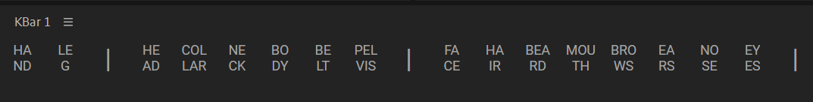

# Scripts Workflow

<!-- ## Work Links -->

<!-- * [](https://docs.google.com/document/d/1sJNVg59lECTmic-aaij0VwGYelqwQ4rrJJDCuV8e_Gw/edit#heading=h.u4h8tkqrgklk)
* [](https://docs.google.com/document/d/121HjJYgc7mvm8BNodyLTcIhrZCGJ-oUjqAScTkdNusA/edit#heading=h.oay92ts1z6q2) -->

Скрипты и плагины очень полезные вещи, без них After Effects не был бы таким популярным. Рано или поздно коллекционирование скриптов превращается в интерфейс космического корабля.


Чтобы оптимизировать свой рабочий процесс, уменьшить количество панелей и дополнительное взаимодействие с ними, я использую известные экспрешены и скрипты или пишу свои собственные. Сохраняю я их в коллекlциях скриптов [Kbar2](https://aescripts.com/kbar/) и [moCode](https://aescripts.com/mocode/).

Главное правило таких кастомных скриптов, чтобы они выполнялись в один клик. То есть никаких всплывающих окон, дополнительных настроек и параметров. Одна кнопка скрипта выполняет конкретную одну функцию, или строго прописанный сценарий действий. Это позволяет значительно ускорить взаимодействие с интерфейсом, а еще можно назначить на такие скрипты шорткат и выполнять эти действия еще быстрее. Конечно есть несколько исключений, но их свожу к минимуму.

## Rename layers\Comps

Скрипт переименовывает группу свойств или слой, в зависимости от того что выбрано. Добавляет текст "handL" из переменной newShapeName к названию слоя, и добавляет нумерацию, если выделено несколько групп или слоев.

Также добавлен фильтр выделенных слоев. Если в переменной sortingType написано "shapes", то из всех выделенных слоев остаются только шейповые, иначе будут переименованы все слои.

> Такая версия скрипта у меня в основном применяется для наименования разных частей персонажей



 

```javascript
app.beginUndoGroup('rename'); {
    var sortingType = "all"; // shapes
    var newShapeName = "handL"
    var copyLayerName = true;
    var numbering = true;
    var sortingLayers = sortingInstance(sortingType);
    layerRename(newShapeName, sortingLayers, copyLayerName, numbering);
} app.endUndoGroup();

function layerRename(textImp, sortLay, copyLayerName, numbering){
    var textIter = "";
    var textPropIter = "";
    var layerName = "";
    var currentLayer;
    var newText = textImp;
    var filteredLayers = sortLay;
    for (var layerIter = 0; layerIter < filteredLayers.length ; layerIter++) {
        currentLayer = filteredLayers[layerIter];
        layerName = currentLayer.name;
        numbering == true ? textIter = "_" + (layerIter + 1) : textIter = "";
        var arrayProperty = currentLayer.selectedProperties;
        if (arrayProperty.length > 0){
            for (var propIter = 0; propIter < arrayProperty.length ; propIter++) {
                numbering == true ? textPropIter = "_" + (propIter + 1) : textPropIter = "";
                if (copyLayerName == true) {
                    arrayProperty[propIter].name = layerName + "_" + newText + textPropIter;
                } else {
                    arrayProperty[propIter].name += "_" + newText + textPropIter;
                }
            }
        } else {
            currentLayer.name = layerName + "_" + newText + textIter;  
        }
    };
}
function sortingInstance(inst){
    var instLayer = inst;
    var currentComp = app.project.activeItem;
    var arrayLayers = currentComp.selectedLayers;
    var sortingLayers = [];
    if (instLayer == "shapes") {
        for (var i in arrayLayers) {
            if (arrayLayers[i] instanceof ShapeLayer) sortingLayers.push(arrayLayers[i]);
        };
    } else{
        sortingLayers = arrayLayers;
    }
    return sortingLayers;
}
```





```javascript
app.beginUndoGroup('rename'); {
    var newText = "handL";
    var arrayLayers = app.project.activeItem.selectedLayers;
    for (var layerIter = 0; layerIter < arrayLayers.length ; layerIter++) {
        var currentLayer = arrayLayers[layerIter];
        var layerName = currentLayer.name;
        var arrayProperty = currentLayer.selectedProperties;
        if (arrayProperty.length > 0){
            for (var propIter = 0; propIter < arrayProperty.length ; propIter++) {
                arrayProperty[propIter].name = layerName + "_" + newText + "_" + (propIter + 1);
            }
        } else {
            currentLayer.name = layerName + "_" + newText + "_" + (layerIter + 1);  
        }
    }
} app.endUndoGroup();
```

 

Кроме переименовывания слоев на разные части тела, часто я использую другие шаблонные наименования для разных слоев, например **_shadow** и **_mask**.

Иногда нужно добавить просто нумерацию слоям. Особенно это критично важно в связывании экспрешенами, чтобы все слои имели уникальное наименование. Этот скрипт добавит повышающую нумерацию для всех выделенных слоев.

```javascript
```

## Compositions

Еще одно ограничение в ae это настройка множества композиций. Когда мы работаем с несколькими композициями проблем нет, но вот если нам нужно поменять например частоту кадров на несколько десятков композиций, то это уже проблема с которой помогут только скрипты. 

## Shapes

## Nulls

## Animations

## Refs
